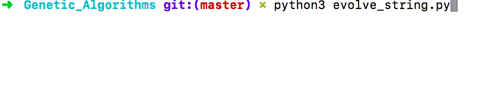

Since my last post, I have recreated the example code which Daniel Schiffman demonstrates in [this video](https://www.youtube.com/watch?v=nrKjSeoc7fc&list=PLRqwX-V7Uu6bJM3VgzjNV5YxVxUwzALHV&index=3), but in Python (Schiffman has published his versions in both Javascript and Java). I have also put all of the code for this into a github repo, which you can check out [here](https://github.com/alexstride/genetic_algorithms).

The program is a really simple genetic algorithm which starts with a target string and tries to evolve it by starting with a population of entirely random strings (made up of just a-z lowercase and spaces) and then calculating how different each of the strings is from the target string. If you want to know more about the workings of the algorithm and the data structures involved then just watch the video linked above, as I have mimicked Schiffman's approach exactly.

With regard to the structure of the code, I have tried to abstract the genetic functionality away from the application of the algorithm (evolving a string in this case). So the [genetic.py](https://github.com/alexstride/genetic_algorithms/blob/master/genetic.py) file functions as a library from which the [evolve_string.py](https://github.com/alexstride/genetic_algorithms/blob/master/evolve_string.py) file imports Population and Individual models (Python classes). the evolve_string file then defines all of the functions relating to creating random strings, mating strings and calculating fitness of strings and passes them as parameters into the Population model.

The model also has an optional parameter of a function to show the current state of the algorithm, which will be called after every generation. In this case, the program prints out the current best string, its fitness and the number of generations which have passed.

That's it for now; here is a gif of the evolve_string program evolving the string "to be or not to be"!

